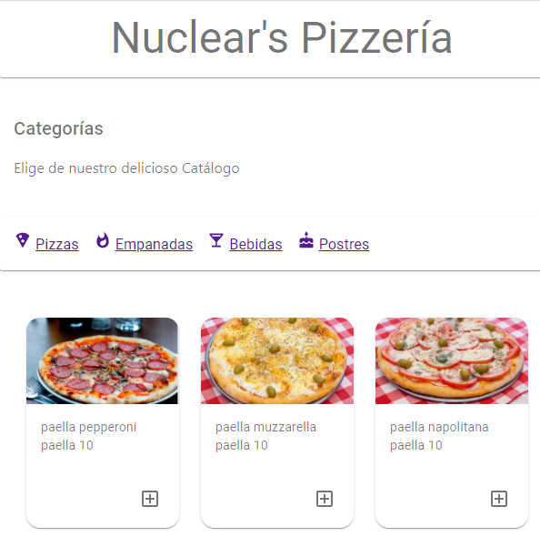
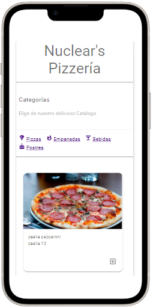

# Getting Started with Create React App

This project was bootstrapped with [Create React App](https://github.com/facebook/create-react-app).

## Available Scripts

In the project directory, you can run:

### `npm start`

Runs the app in the development mode.\
Open [http://localhost:3000](http://localhost:3000) to view it in your browser.

# Nuclear technical test

The project is a simple web application that allows users to buy food from a catalog

## frontend screenshots

### `desktop view`

### `mobile views`

